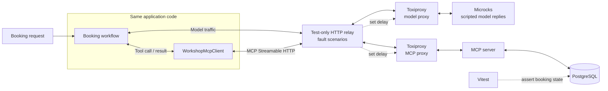
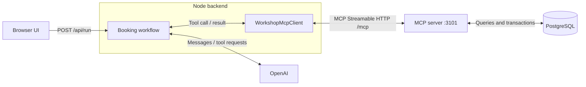

# The Last Seat

A small demo for testing an AI booking agent. It finds an afternoon workshop about testing AI applications and books the last seat.

The tests cover what happens when the model is slow, a tool times out, or two people try to book that seat. They use the application workflow, a real MCP server and PostgreSQL, with scripted model replies from Microcks.

## Run the tests

You need Node.js 22.6+, npm 9+ and a running Docker engine.

```bash
npm ci
npm test
```

No OpenAI key or Compose setup needed. Testcontainers starts the test infrastructure and removes it afterwards. The first run takes longer while Docker downloads the images.

Run just the integration suite or one scenario:

```bash
npm run test:integration
npm run test:integration:slow-model
npm run test:integration:slow-search
npm run test:integration:concurrency
```

To select any test by name:

```bash
npx vitest run tests/integration/last-seat.test.ts -t "reservation timeout"
```

## How the tests work



- **Testcontainers** starts PostgreSQL, MCP, Microcks and Toxiproxy on an isolated network with random host ports. Tests and Compose use the same MCP image.
- **Microcks** returns tool calls based on the scenario and conversation so each test gets a repeatable model response.
- **Toxiproxy** delays responses. Requests still reach the server, so a reservation can commit before its response times out.
- **The test-only relay** identifies the request to delay from its model messages or MCP tool name. Scenarios without faults connect directly to the Toxiproxy routes. There are no test hooks in application code.
- **Vitest** checks the result, tool calls, attempts, database rows and remaining seats. Each test starts with fresh seed data and cleared network faults.

Start with [the integration tests](tests/integration/last-seat.test.ts). The setup is in [testcontainers.ts](tests/support/testcontainers.ts), fault selection in [fault-proxy.ts](tests/support/fault-proxy.ts), and model replies in [the Microcks fixture](microcks/openai-chat-completions.yaml).

## What we test

| Scenario | Expected result |
| --- | --- |
| Happy path | One reservation. Capacity decreases once. |
| Slow model | Request times out. No tools run and no seat is booked. |
| Slow search | Availability fails explicitly. No reservation is attempted. |
| Delayed explanation | The booking stays confirmed even if the final model response times out. |
| Reservation timeout | Recover the committed reservation using the same request ID, without another write. |
| Repeated reservation | Return the existing booking. No duplicate row or capacity change. |
| Last-seat concurrency | Two attendees compete. One books, one gets unavailable. |
| Invalid arguments / tool error | Report the failure without changing the database. |
| Idempotency conflict | Reject a request ID reused for another attendee. |
| Empty search / search ordering | Stop when nothing matches; order matches by schedule. |
| Session cleanup | Closing the MCP client releases its server session. |
| Mock contract | Unexpected Microcks requests return HTTP 422. |

There are also two [LangSmith configuration tests](tests/unit/langsmith.test.ts).

Booking safety lives in [the database transaction](src/db/database.ts): a unique request ID, locks and a capacity check prevent duplicate bookings and overselling. The workflow uses timeouts and an overall deadline, with retries disabled by default.

These tests check application behavior with scripted model replies. Real-model tool selection and answer quality need separate evaluations.

## Run the browser demo

Create `.env` from [.env.example](.env.example) if needed and set `OPENAI_API_KEY`.

```bash
docker compose up --build --detach --wait
npm run dev
```

Open <http://localhost:5173>. Compose runs PostgreSQL and MCP; the UI and backend run on your host.



The workflow discovers MCP tools, sends tool definitions to the model, validates the returned arguments and executes the calls through `WorkshopMcpClient`. Results go back to the model for the next step.

MCP exposes `search_workshops`, `reserve_seat` and `get_reservation`. The workflow uses the last one to reconcile a timed-out booking. Attendee details and the request ID come from the backend.

Stop the app with **Ctrl+C**, then run `docker compose down`. Database data is preserved. Use `docker compose down --volumes` only when you want to delete it.

## Optional traces

Set these in `.env`:

```dotenv
LANGSMITH_TRACING=true
LANGSMITH_API_KEY=<your-key>
LANGSMITH_PROJECT="The Last Seat"
```

Restart the app or rerun the tests. Find traces in LangSmith under **Observability → Projects**. Test traces use the Vitest test name and include model and MCP calls.

## Useful checks

```bash
npm run typecheck
npm run build
docker compose ps
docker compose logs -f
```

If Docker is unavailable, check `docker info`. If the browser backend cannot connect, check that the Compose services are healthy. Their default ports are `5432` and `3101`; tests use random ports.

When switching between macOS and a Linux sandbox, run `npm ci` where you plan to start the app. Native dependencies in `node_modules` are platform-specific.
